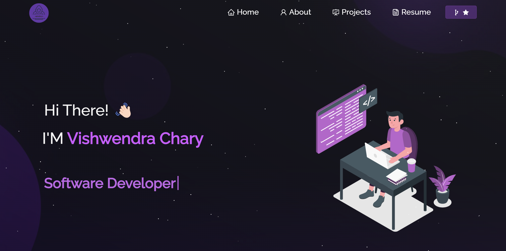

<h2 align="center">
  Portfolio Website - v2.0 
  <a href="https://vishwendra-portfolio.vercel.app" target="_blank">mvc.tech</a>
</h2>

  

 

## TL;DR

Feel free to fork this repository to customize and personalize it for your own use. Kindly provide appropriate credit by linking back to [vishwendra](https://github.com/vishwendra04/Vishwendra-Portfolio). Thank you for your support!

## Built With

This meticulously crafted personal portfolio, available at <a href="https://vishwendra-portfolio.vercel.app" target="_blank">mvc.tech</a>, serves as an elegant showcase of my GitHub projects, comprehensive resume, and technical acumen. The following technologies were employed in its creation:

- React.js
- Node.js
- Express.js
- CSS3
- Visual Studio Code
- Vercel (Deployment)

## Features

**📖 Dynamic Multi-Page Layout**  
**🎨 Aesthetic Styling with React-Bootstrap and Custom CSS for Seamless Customization**  
**📱 Fully Adaptive and Responsive Design for Optimal User Experience**

## Getting Started

To get started, clone this repository onto your local machine. Ensure that `node.js` and `git` are installed globally.

## 🛠 Installation and Setup Instructions

1. Install dependencies: `npm install`
2. To run the project locally, navigate to the project directory and execute: `npm start`

This will launch the app in development mode. You can view it in your browser at [http://localhost:3000](http://localhost:3000). Any changes made will trigger an automatic page reload.

## Usage Instructions

Navigate to `/src/components/` within the project directory.  
Here, you will find all the components used throughout the portfolio, where you can easily update your personal information, projects, and technical skills.

---

# Vishwendra-Portfolio
This repository stands as a testament to my journey as a passionate developer, showcasing my proficiency in the MERN stack, C++, and Python. The portfolio highlights a diverse range of full-stack projects, responsive designs, and cutting-edge solutions, underscoring my problem-solving abilities, relentless pursuit of knowledge, and dedication to crafting impactful applications that solve real-world challenges.
